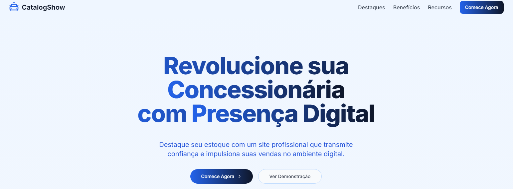
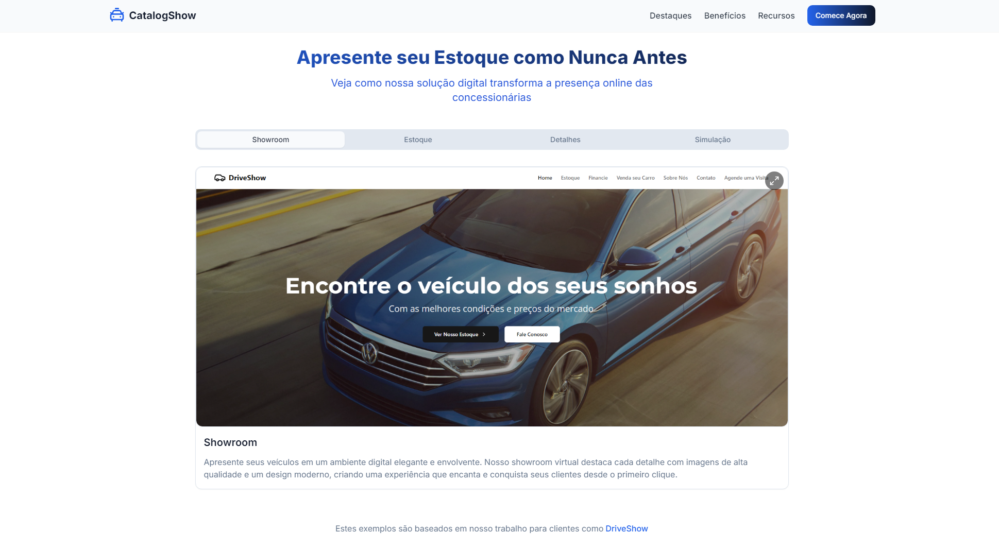
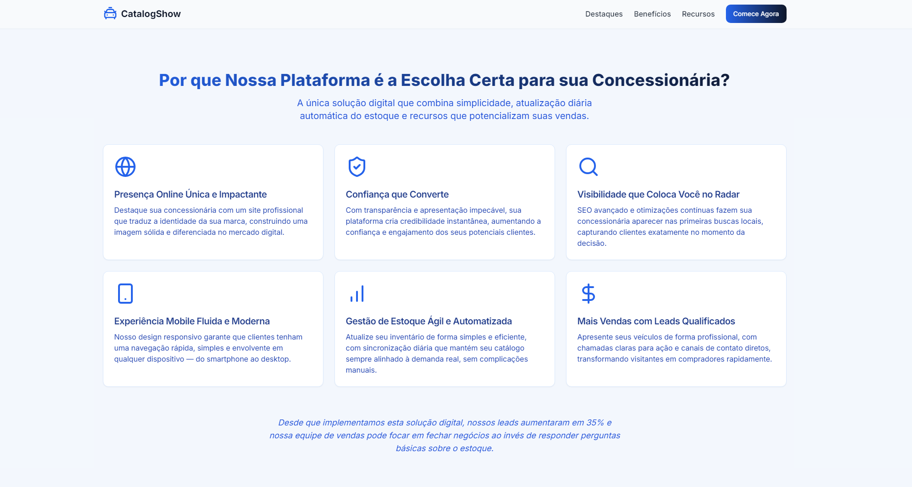

# 🚗 CatalogShow – Landing Page | DriveShow

A **CatalogShow** é uma landing page profissional desenvolvida para apresentar todo o potencial do **DriveShow** – um catálogo digital interativo pensado para o mercado automotivo. Esta página serve como ponto de entrada para clientes e parceiros, oferecendo uma visão clara, moderna e objetiva das funcionalidades e vantagens do produto.

---

## 📸 Demonstrações Visuais

### 🏠 Home (Primeira Dobra)

Abertura visual com chamada direta para ação. Mostra de forma objetiva o que é o DriveShow e convida o usuário a continuar explorando.


<!-- Substitua o link acima pelo seu caminho correto ou URL externa -->

---

### 📽️ Apresentação do DriveShow

Demonstração da interface do catálogo em funcionamento. Aqui destacamos como o cliente pode navegar e visualizar os veículos com facilidade e agilidade.


<!-- Ideal para uma imagem animada ou print com interação -->

---

### 🌟 Vantagens e Benefícios

Seção explicativa sobre os diferenciais competitivos do DriveShow. Ideal para convencer o visitante da utilidade e valor do produto.



---

## 🧠 Funcionalidades da Landing Page

- Navegação fluida e responsiva  
- Apresentação clara do produto (texto + imagem + animação)  
- Blocos de informações com CTA (Call-to-Action)  
- Depoimentos e diferenciais  
- Integração com mapas e links externos  
- Otimização para SEO e carregamento rápido  

---

## 🚀 Tecnologias Utilizadas

- **Next.js 13 (App Router)**
- **React 18**
- **TypeScript**
- **Tailwind CSS**
- **Framer Motion**
- **Radix UI**

---

## 📍 Estrutura da Página

- `HeroSection`: Apresentação principal com CTA  
- `AboutSection`: Explicação sobre o DriveShow  
- `DemoSection`: Demonstração do sistema em ação  
- `BenefitsSection`: Vantagens e diferenciais  
- `TestimonialSection`: Depoimentos (opcional)  
- `Footer`: Contato, redes sociais, e link para acessar o catálogo

---

## 🌐 Acesse o projeto online

🔗 [Clique aqui para acessar a landing page](https://seulink.vercel.app)

---

## 📂 Como rodar localmente

```bash
git clone https://github.com/seunome/catalogshow.git
cd catalogshow
npm install
npm run dev
